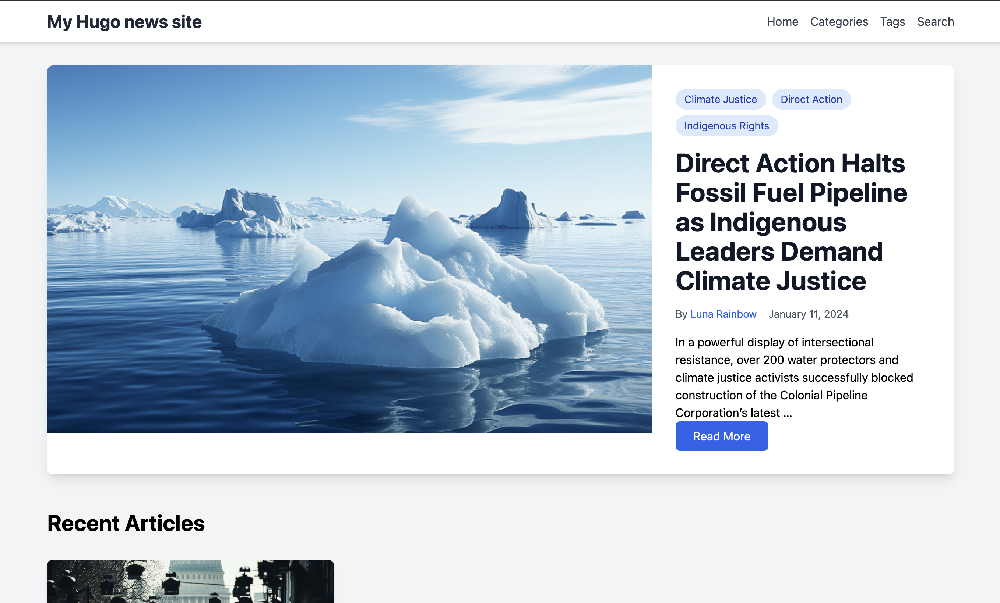

# Hugo News Theme

A modern, responsive Hugo theme designed for news and media websites. Built with Tailwind CSS and Alpine.js.



## Features

- 🎨 Modern design with Tailwind CSS
- 🔍 Built-in search functionality
- 📱 Fully responsive
- 🏷️ Support for categories, tags, and authors
- 🖼️ Featured articles with large images
- 🔄 Dynamic category browsing
- 👥 Author profiles
- 🔍 Search functionality with Fuse.js
- ⚡ Fast loading with minimal JavaScript
- 🎨 Clean typography and spacing

## Installation

1. In your Hugo site directory, run:
```bash
git submodule add https://github.com/professionalaf/hugo-news themes/hugo-news
```

2. Update your `hugo.toml` configuration:
```toml
theme = "hugo-news"
```

## Configuration

Example `hugo.toml` configuration:

```toml
baseURL = 'https://example.org/'
languageCode = 'en-US'
title = 'My Hugo News Site'

[taxonomies]
  category = "categories"
  tag = "tags"
  author = "authors"

[outputs]
  home = ["HTML", "RSS", "JSON"]

[[menus.main]]
name = "Home"
url = "/"
weight = 10

[[menus.main]]
name = "Categories"
url = "/categories"
weight = 20

[[menus.main]]
name = "Tags"
url = "/tags"
weight = 30
```

## Content Structure

```
content/
├── _index.md
├── articles/
│   ├── first-post.md
│   └── second-post.md
├── authors/
│   ├── _index.md
│   └── john-doe/
│       ├── _index.md
│       └── avatar.jpg
└── categories/
    └── _index.md
```

### Article Front Matter

```yaml
---
title: "Article Title"
date: 2024-01-01
author: "Author Name"
categories: ["Category1", "Category2"]
tags: ["tag1", "tag2"]
featured_image: "path/to/image.jpg"
description: "Article description"
---
```

### Author Front Matter

```yaml
---
title: "Author Name"
bio: "Author biography"
avatar: "author-image.jpg"
social:
  twitter: "twitterhandle"
  linkedin: "linkedinprofile"
---
```

## Comments System

The theme includes two types of comment systems:

### Static Comments

Static comments are permanently stored in the site's data directory. They are visible to all users and persist across sessions. To add static comments:

1. Create a JSON file in the `data` directory with the format: `YYYY-MM-DD-{article-directory-name}-comments.json`
2. Use this structure:
```json
{
  "comments": [
    {
      "name": "Author Name",
      "content": "Comment text",
      "date": "YYYY-MM-DDTHH:mm:ss-05:00",
      "isStatic": true
    }
  ]
}
```

### Dynamic Comments

Dynamic comments are stored in the user's browser localStorage. These comments:
- Only visible to the user who created them
- Persist across page refreshes but only in the same browser
- Are not shared with other users
- Will be cleared if the user clears their browser data

Dynamic comments are automatically handled by the theme's JavaScript and don't require any setup.

# Development

Requirements:
- Hugo Extended Version (>= 0.116.0)
- Node.js (for Tailwind CSS development)

## Contributing

1. Fork the repository
2. Create your feature branch (`git checkout -b feature/amazing-feature`)
3. Commit your changes (`git commit -m 'Add amazing feature'`)
4. Push to the branch (`git push origin feature/amazing-feature`)
5. Open a Pull Request

## License

Released under the [MIT License](LICENSE).

## Credits

- Built with [Tailwind CSS](https://tailwindcss.com/)
- Interactive components powered by [Alpine.js](https://alpinejs.dev/)
- Search functionality using [Fuse.js](https://fusejs.io/)
